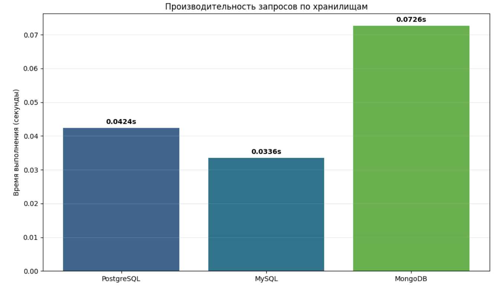

# Сравнительный анализ хранилищ данных для ETL-процессов

## Цель лабораторной работы

Развернуть Apache Airflow в Docker и реализовать ETL-процессы, загружающие данные о поездах в слой ODS трёх разных хранилищ (PostgreSQL, MySQL, MongoDB), а затем провести сравнительный анализ этих хранилищ по скорости выполнения запросов.

В качестве источника данных используется парсер информации о поездах с сайта Яндекс.Путешествия.

## Архитектура решения

### Оркестрация ETL в Apache Airflow

Airflow-кластер развёрнут с помощью docker-compose (файл `docker-compose.yaml`). В состав кластера входят:

- `postgres` – служебная БД Airflow (метаданные)
- `redis` – брокер сообщений для CeleryExecutor
- `airflow-webserver`, `airflow-scheduler`, `airflow-worker`, `airflow-triggerer`, `airflow-init`

Дополнительный провайдер для MongoDB устанавливается через переменную `_PIP_ADDITIONAL_REQUIREMENTS` (apache-airflow-providers-mongo).

### Хранилища данных (ODS)

Для слоя ODS развёрнуты три отдельные СУБД:

**PostgreSQL** (служба `postgres_ods`)

- Порт: 5433
- Поддержка JSONB, продвинутые SQL-функции

**MySQL** (служба `mysql_ods`)

- Порт: 3307
- Поддержка JSON, популярная реляционная СУБД

**MongoDB** (служба `mongo_ods`)

- Порт: 27018
- База: `ods_trains`
- Документоориентированное хранилище для гибкого хранения JSON

### Источник данных

Парсер данных о поездах с сайта Яндекс.Путешествия. Сервер парсинга запускается отдельно и доступен по адресу, указанному в переменной Airflow `TRAIN_SERVER_URL` (по умолчанию `http://host.docker.internal:8888`).

## Реализация ETL-процессов (DAGи)

В каталоге `dags` реализовано три DAGа:

### 1. trains_basic_dag

Загружает базовую информацию о поездах:

- **Extract**: запрос к серверу парсинга, получение списка поездов
- **Transform**: нормализация данных (номер поезда, название, перевозчик, станции, время, цена)
- **Load**: параллельная загрузка в PostgreSQL (`ods_trains_basic_pg`), MySQL (`ods_trains_basic_mysql`), MongoDB (`ods_trains_basic`)

Расписание: каждые 15 минут (`5,20,35,50 * * * *`)

### 2. trains_cars_dag

Загружает информацию о вагонах:

- Таблицы: `ods_trains_cars_pg`, `ods_trains_cars_mysql`
- Коллекция: `ods_trains_cars`

Расписание: каждые 15 минут (`10,25,40,55 * * * *`)

### 3. trains_seats_dag

Загружает информацию о местах в вагонах:

- Таблицы: `ods_trains_seats_pg`, `ods_trains_seats_mysql`
- Коллекция: `ods_trains_seats`

Расписание: каждые 15 минут (`15,30,45,0 * * * *`)

Во всех DAGах используется цепочка задач: `extract → transform → [load_postgres, load_mysql, load_mongo]`.

## Сравнительный анализ хранилищ

Для сравнения производительности реализован Jupyter notebook `performance_benchmark.ipynb`, который выполняет запросы `COUNT(*)` ко всем таблицам в трёх хранилищах и измеряет время выполнения.

### Методика бенчмарка

Для каждого хранилища выполняется:

- Подсчёт записей в таблицах `ods_trains_basic_*`, `ods_trains_cars_*`, `ods_trains_seats_*`
- Измерение времени выполнения каждого запроса
- Расчёт среднего времени по всем таблицам

### Результаты

**Краткий вывод**: PostgreSQL демонстрирует наименьшее среднее время выполнения запросов, MySQL показывает сопоставимые результаты, а MongoDB имеет более высокое среднее время и больший разброс значений.

### Качественные выводы

**PostgreSQL**

- Оптимален для аналитических запросов благодаря поддержке JSONB
- Богатый набор функций агрегации
- Эффективный планировщик запросов
- Подходит для слоя ODS и последующей аналитики

**MySQL**

- Сопоставимое время на простые запросы
- Подходит для хранения нормализованных ODS-таблиц
- Менее удобен для сложной аналитики по сравнению с PostgreSQL

**MongoDB**

- Отлично подходит для хранения сырых JSON-документов
- Гибкая схема без миграций
- Для сложной бизнес-аналитики реляционные СУБД удобнее

## Выбор оптимального хранилища

Учитывая структуру данных (поезда, вагоны, места хорошо описываются реляционной моделью), потребность в аналитических запросах и результаты бенчмарка, **наиболее подходящим хранилищем является PostgreSQL**:

- Позволяет хранить нормализованные поля и полный сырой JSON (JSONB)
- Поддерживает удобную агрегацию напрямую в SQL
- Обеспечивает хорошую производительность на чтение

MySQL показал себя приемлемым как альтернативное реляционное ODS-хранилище. MongoDB рекомендуется использовать для хранения сырых JSON-документов, однако для построения регулярных отчётов более удобен реляционный слой (PostgreSQL).

## Заключение

В ходе работы был развёрнут кластер Apache Airflow в Docker и реализованы ETL-процессы для загрузки данных о поездах в слой ODS трёх различных хранилищ. На основе экспериментального сравнения сделан вывод о целесообразности выбора PostgreSQL в качестве основного аналитического хранилища.
